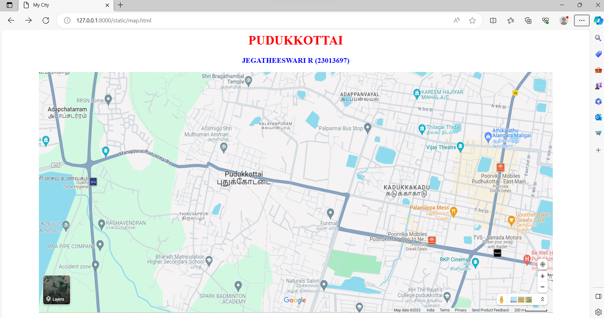
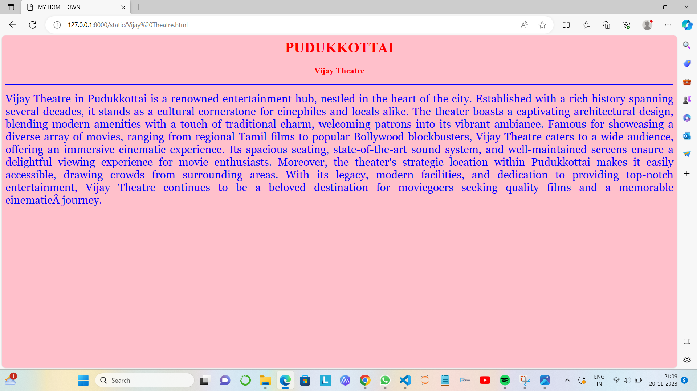
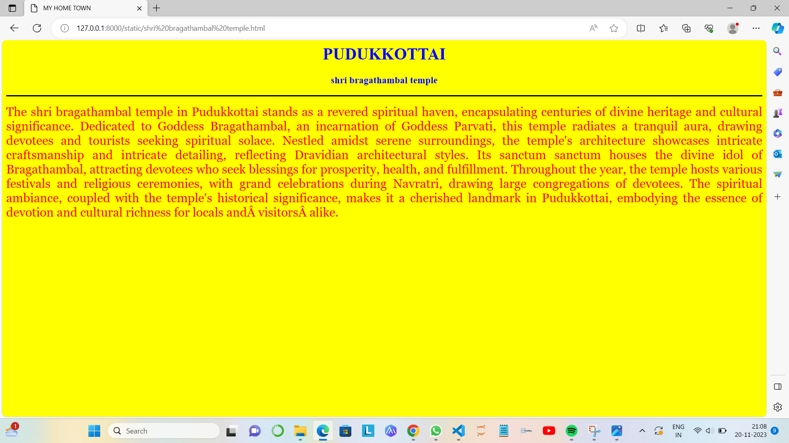
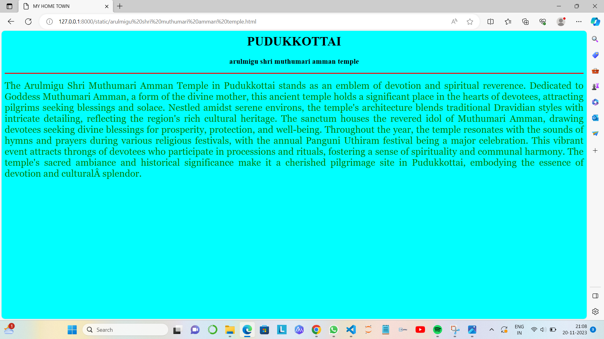
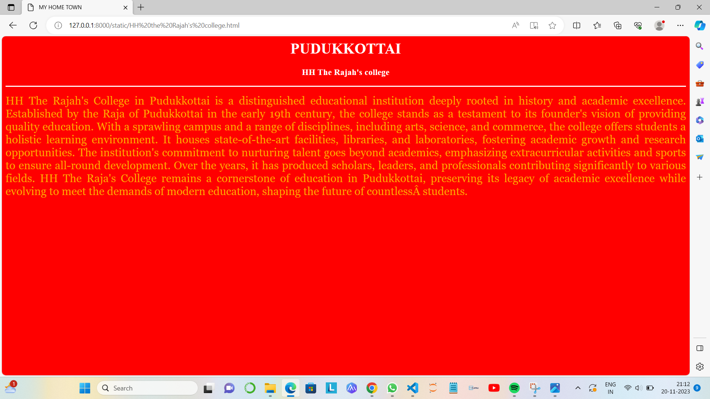
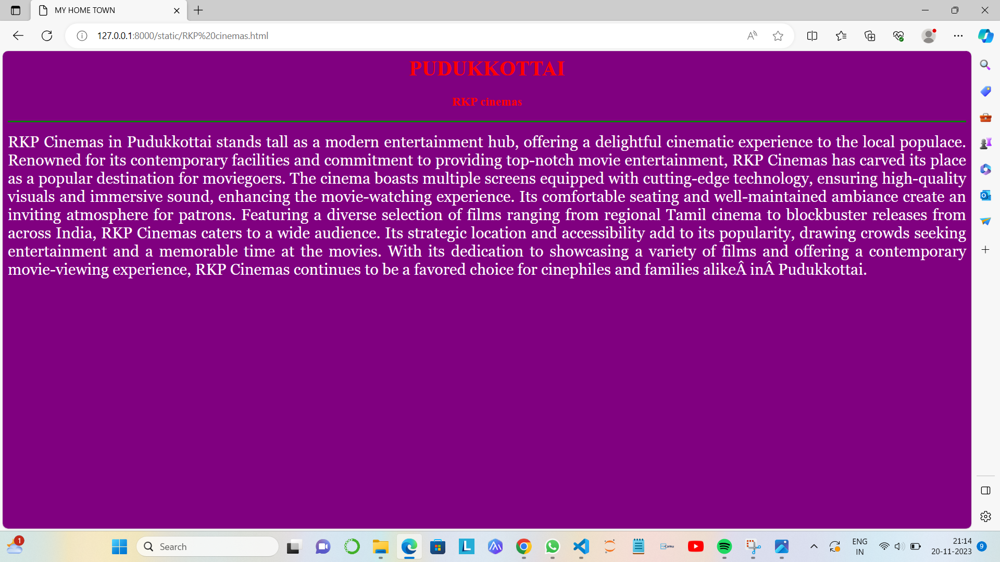

# Ex04 Places Around Me
## Date: 20.11.2023

## AIM
To develop a website to display details about the places around my house.

## DESIGN STEPS

### STEP 1
Create a Django admin interface.

### STEP 2
Download your city map from Google.

### STEP 3
Using ```<map>``` tag name the map.

### STEP 4
Create clickable regions in the image using ```<area>``` tag.

### STEP 5
Write HTML programs for all the regions identified.

### STEP 6
Execute the programs and publish them.

## CODE
```
map.html

<html>
<head>
<title>My City</title>
</head>
<body>
<h1 align="center">
<font color="red"><b>PUDUKKOTTAI</b></font>
</h1>
<h3 align="center">
<font color="blue"><b>JEGATHEESWARI R (23013697)</b></font>
</h3>
<center>

<map name="MyCity">
<area shape="RECT" coords="950,180,1100,200" href="Vijay Theatre.html" title="Vijay Theatre">
<area shape="RECT" coords="400,10,550,50" href="shri bragathambal temple.html" title="shri bragathambal temple">
<area shape="RECT" coords="350,100,500,200" href="arulmigu shri muthumari amman temple.html" title="arulmigu shri muthumari amman temple">
<area shape="RECT" coords="900,550,1050,600" href="HH the Rajah's college.html" title="HH the Rajah's college">
<area shape="RECT" coords="1000,470,1100,510" href="RKP cinemas.html" title="RKP cinemas">
</map>
</center>
</body>
</html>

Vijay Theatre.html

<html>
<head>
<title>MY HOME TOWN</title>
</head>
<body bgcolor="pink">
<h1 align="center">
<font color="red"><b>PUDUKKOTTAI</b></font>
</h1>
<h3 align="center">
<font color="red"><b>Vijay Theatre</b></font>
</h3>
<hr size="3" color="blue">
<p align="justify">
<font face="Georgia" size="5" color="blue">
    Vijay Theatre in Pudukkottai is a renowned entertainment hub, nestled in the heart of the city. Established with a rich history spanning several decades, it stands as a cultural cornerstone for cinephiles and locals alike. The theater boasts a captivating architectural design, blending modern amenities with a touch of traditional charm, welcoming patrons into its vibrant ambiance.

Famous for showcasing a diverse array of movies, ranging from regional Tamil films to popular Bollywood blockbusters, Vijay Theatre caters to a wide audience, offering an immersive cinematic experience. Its spacious seating, state-of-the-art sound system, and well-maintained screens ensure a delightful viewing experience for movie enthusiasts.

Moreover, the theater's strategic location within Pudukkottai makes it easily accessible, drawing crowds from surrounding areas. With its legacy, modern facilities, and dedication to providing top-notch entertainment, Vijay Theatre continues to be a beloved destination for moviegoers seeking quality films and a memorable cinematic journey.
</font>
</p>
</body>
</html>

shri bragathambal temple.html

<html>
<head>
<title>MY HOME TOWN</title>
</head>
<body bgcolor="yellow">
<h1 align="center">
<font color="blue"><b>PUDUKKOTTAI</b></font>
</h1>
<h3 align="center">
<font color="blue"><b>shri bragathambal temple</b></font>
</h3>
<hr size="3" color="black">
<p align="justify">
<font face="Georgia" size="5" color="red">
    The shri bragathambal temple in Pudukkottai stands as a revered spiritual haven, encapsulating centuries of divine heritage and cultural significance. Dedicated to Goddess Bragathambal, an incarnation of Goddess Parvati, this temple radiates a tranquil aura, drawing devotees and tourists seeking spiritual solace.

Nestled amidst serene surroundings, the temple's architecture showcases intricate craftsmanship and intricate detailing, reflecting Dravidian architectural styles. Its sanctum sanctum houses the divine idol of Bragathambal, attracting devotees who seek blessings for prosperity, health, and fulfillment.

Throughout the year, the temple hosts various festivals and religious ceremonies, with grand celebrations during Navratri, drawing large congregations of devotees. The spiritual ambiance, coupled with the temple's historical significance, makes it a cherished landmark in Pudukkottai, embodying the essence of devotion and cultural richness for locals and visitors alike.
</font>
</p>
</body>
</html>

arulmigu shri muthumari amman temple.html

<html>
<head>
<title>MY HOME TOWN</title>
</head>
<body bgcolor="cyan">
<h1 align="center">
<font color="black"><b>PUDUKKOTTAI</b></font>
</h1>
<h3 align="center">
<font color="black"><b>arulmigu shri muthumari amman temple</b></font>
</h3>
<hr size="3" color="red">
<p align="justify">
<font face="Georgia" size="5" color="green">
    The Arulmigu Shri Muthumari Amman Temple in Pudukkottai stands as an emblem of devotion and spiritual reverence. Dedicated to Goddess Muthumari Amman, a form of the divine mother, this ancient temple holds a significant place in the hearts of devotees, attracting pilgrims seeking blessings and solace.

Nestled amidst serene environs, the temple's architecture blends traditional Dravidian styles with intricate detailing, reflecting the region's rich cultural heritage. The sanctum houses the revered idol of Muthumari Amman, drawing devotees seeking divine blessings for prosperity, protection, and well-being.

Throughout the year, the temple resonates with the sounds of hymns and prayers during various religious festivals, with the annual Panguni Uthiram festival being a major celebration. This vibrant event attracts throngs of devotees who participate in processions and rituals, fostering a sense of spirituality and communal harmony. The temple's sacred ambiance and historical significance make it a cherished pilgrimage site in Pudukkottai, embodying the essence of devotion and cultural splendor.
</font>
</p>
</body>
</html>

HH The Rajah's college.html

<html>
<head>
<title>MY HOME TOWN</title>
</head>
<body bgcolor="red">
<h1 align="center">
<font color="white"><b>PUDUKKOTTAI</b></font>
</h1>
<h3 align="center">
<font color="white"><b>HH The Rajah's college</b></font>
</h3>
<hr size="3" color="white">
<p align="justify">
<font face="Georgia" size="5" color="orange">
    HH The Rajah's College in Pudukkottai is a distinguished educational institution deeply rooted in history and academic excellence. Established by the Raja of Pudukkottai in the early 19th century, the college stands as a testament to its founder's vision of providing quality education.

With a sprawling campus and a range of disciplines, including arts, science, and commerce, the college offers students a holistic learning environment. It houses state-of-the-art facilities, libraries, and laboratories, fostering academic growth and research opportunities.

The institution's commitment to nurturing talent goes beyond academics, emphasizing extracurricular activities and sports to ensure all-round development. Over the years, it has produced scholars, leaders, and professionals contributing significantly to various fields.

HH The Raja's College remains a cornerstone of education in Pudukkottai, preserving its legacy of academic excellence while evolving to meet the demands of modern education, shaping the future of countless students.
 </font>
</p>
</body>
</html>

RKP cinemas.html

<html>
<head>
<title>MY HOME TOWN</title>
</head>
<body bgcolor="purple">
<h1 align="center">
<font color="red"><b>PUDUKKOTTAI</b></font>
</h1>
<h3 align="center">
<font color="red"><b>RKP cinemas</b></font>
</h3>
<hr size="3" color="green">
<p align="justify">
<font face="Georgia" size="5" color="white">
    RKP Cinemas in Pudukkottai stands tall as a modern entertainment hub, offering a delightful cinematic experience to the local populace. Renowned for its contemporary facilities and commitment to providing top-notch movie entertainment, RKP Cinemas has carved its place as a popular destination for moviegoers.

    The cinema boasts multiple screens equipped with cutting-edge technology, ensuring high-quality visuals and immersive sound, enhancing the movie-watching experience. Its comfortable seating and well-maintained ambiance create an inviting atmosphere for patrons.
    
    Featuring a diverse selection of films ranging from regional Tamil cinema to blockbuster releases from across India, RKP Cinemas caters to a wide audience. Its strategic location and accessibility add to its popularity, drawing crowds seeking entertainment and a memorable time at the movies.
    
    With its dedication to showcasing a variety of films and offering a contemporary movie-viewing experience, RKP Cinemas continues to be a favored choice for cinephiles and families alike in Pudukkottai.


 </font>
</p>
</body>
</html>

```


## OUTPUT






## RESULT
The program for implementing image maps using HTML is executed successfully.
